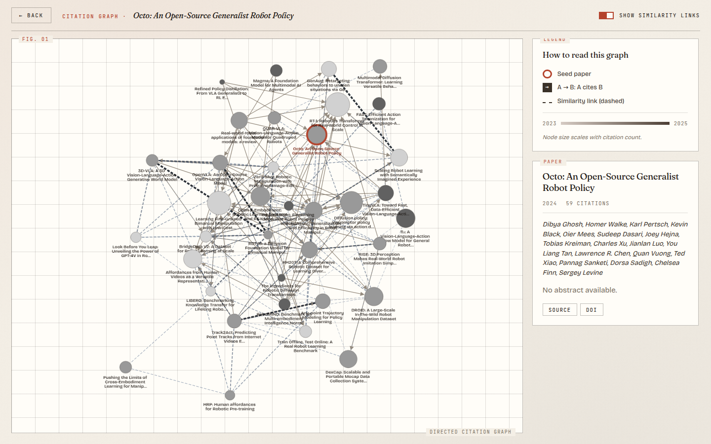
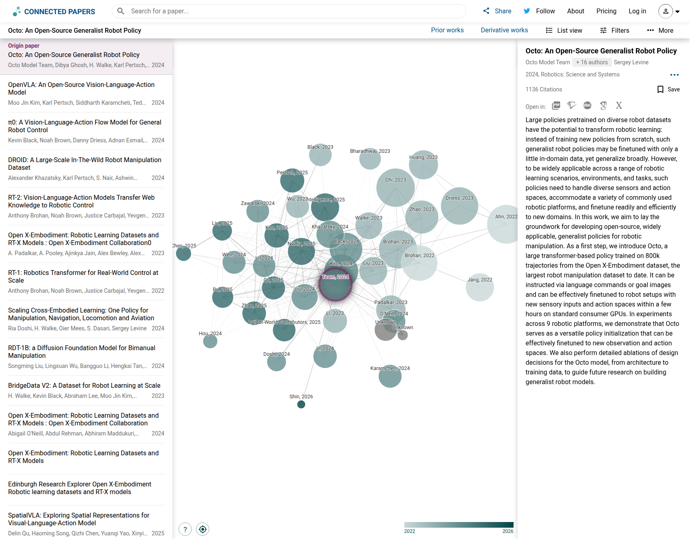

# Better Connected Paper

> A literature map where the arrows actually tell you who cites whom.

<p align="center">
  
</p>

## Why this exists

[Connected Papers](https://www.connectedpapers.com/) is a lovely way to find
related work, but it draws its graphs as **undirected** similarity blobs. That
hides the single most load‑bearing fact in academic literature: who built on
whom.

If you're tracing a field backwards (*what did this paper borrow from?*) or
forwards (*who ran with this idea?*), direction is the whole point. Better
Connected Paper keeps the familiar force‑directed layout, but every citation
edge is an arrow: **A → B** means "A cites B". The similarity view is still
there as a toggleable overlay — you get both readings, one click apart.

### Same seed, two tools

<table width="100%">
  <tr>
    <td align="center" width="50%"><b>Connected Papers</b><br/><sub>undirected similarity</sub></td>
    <td align="center" width="50%"><b>Better Connected Paper</b><br/><sub>directed citations</sub></td>
  </tr>
  <tr>
    <td></td>
    <td></td>
  </tr>
</table>

## What you get

- **Directed 2‑hop citation graph** around any seed paper — arrows are the point.
- **Toggleable similarity overlay** blending bibliographic coupling, co‑citation, and direct‑link weight, drawn as dashed edges so it never competes with the citation layer.
- **Year‑gradient colour & citation‑count sizing** so the visual hierarchy survives a glance.
- **Shareable URLs** — `?seed=W4405…` rehydrates the full graph for a collaborator.
- **Editorial, close‑reading UI** — typography borrowed from printed journals rather than SaaS dashboards.
- **Postgres cache** — a second visit to the same seed loads in under 200&nbsp;ms.

## Try it locally

One file, one command:

```bash
cp .env.example .env        # optional: set OPENALEX_EMAIL to join the polite pool
mise install                # Go 1.25 + Node 22
mise run dev                # docker compose: postgres + backend + frontend
```

Open <http://localhost:5173> and search for a paper. *Attention Is All You
Need* and *Neural radiance fields* are good first seeds if you just want to
see the layout in motion.

<p align="center">
  
</p>

## How it works

For a given seed *S*, the backend asks the configured provider
([OpenAlex](https://openalex.org) by default, with
[OpenCitations](https://opencitations.net) as a supplement and Semantic Scholar
available as an opt‑in tertiary) for *S*'s metadata, references, and citations.
That pool — everything one hop away from *S* — is then re‑fetched in batches to
pick up each candidate's own references.

Every candidate *p* gets scored with the Connected Papers–faithful
formulation: the mean of two Salton (cosine) indices — bibliographic coupling
over what they both cite, and co‑citation over who cites them both.

```
sim(S, p) = ½ · |refs(S) ∩ refs(p)|  / √(|refs(S)|·|refs(p)|)
          + ½ · |citers(S) ∩ citers(p)| / √(|citers(S)|·|citers(p)|)
```

A 2‑hop bridge that shares many citers with the seed can therefore out‑rank a
directly‑cited paper that shares no structural context. The top ~40 candidates
become nodes (the seed always survives); for any pair *(a, b)* in that set, if
*a* cites *b* we draw an arrow *a → b*. Similarity edges are computed
separately and toggled client‑side, so the citation layer stays readable by
default. The whole graph is persisted as a JSON blob keyed by seed ID with a
30‑day TTL.

The frontend renders all of this with [Cytoscape.js](https://js.cytoscape.org/)
and the cose‑bilkent layout, with a small pure transform in
[`frontend/src/lib/graphElements.ts`](./frontend/src/lib/graphElements.ts) that
makes the node/edge mapping unit‑testable on its own.

## Stack

- **Backend** — Go 1.25 with [chi](https://github.com/go-chi/chi),
  [pgx/v5](https://github.com/jackc/pgx), embedded migrations via
  [golang‑migrate](https://github.com/golang-migrate/migrate), and
  `golang.org/x/time/rate` to stay inside every provider's polite budget.
- **Frontend** — React 19, TypeScript 5.7, Vite 6, Cytoscape.js.
- **Storage** — Postgres (Neon in production, docker‑compose locally).
- **Deploy** — two Vercel projects plus a managed Postgres, see
  [DEPLOYMENT.md](./DEPLOYMENT.md).

## HTTP API

All JSON under `/api`. The exact TypeScript shapes live in
[`frontend/src/types/api.ts`](./frontend/src/types/api.ts).

| Endpoint | Purpose |
| --- | --- |
| `GET  /api/health` | liveness |
| `GET  /api/search?q=<q>&limit=<n>` | provider‑backed paper search |
| `GET  /api/paper/{id}` | full metadata for one paper |
| `POST /api/graph/build` | build (or return cached) directed graph for a seed |
| `GET  /api/graph/{seedId}` | cache‑only lookup; 404 if never built |

`POST /api/graph/build` returns the node/edge payload the frontend consumes,
plus an `X-Cache: hit|miss` header so you can tell whether Postgres or the
upstream providers did the work.

## Tests

```bash
mise run test               # backend go test + frontend vitest
mise run test:integration   # DB-backed store tests; needs a running Postgres + DATABASE_URL
```

The interesting ones:

- `backend/internal/citation` — httptest mocks covering 200 / 429 / 5xx paths.
- `backend/internal/graph` — table‑driven similarity and edge‑direction checks.
- `backend/internal/store` — DB‑backed store tests, gated by `-tags=integration`; start `mise run dev` (or point `DATABASE_URL` at any Postgres) before running.
- `frontend/src/lib/graphElements.test.ts` — the pure node/edge transform.

## Roadmap

- Playwright E2E covering the *search → graph → detail* happy path.
- Multi‑seed graphs for side‑by‑side comparison of two papers.
- Embedding‑based similarity as a third overlay.
- Saveable collections for long reading sessions.

## License

MIT — see [LICENSE](./LICENSE).
